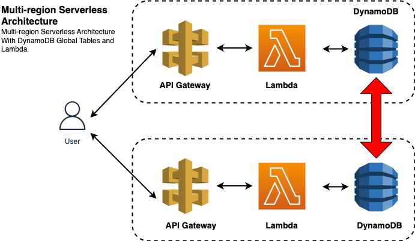

<p align="center">
  <a href="http://nestjs.com/" target="blank"></a>
  <a>
</p>

[circleci-image]: https://img.shields.io/circleci/build/github/nestjs/nest/master?token=abc123def456
[circleci-url]: https://circleci.com/gh/nestjs/nest

## Multi-region serverless architecture

Multi-region serverless architecture with DynamoDB Global Tables, Lambda, CloudFormation, and Serverless Framework

## Architecture



This is a Serverless architecture where NestJS REST APIs are implemented in AWS Lambda connected to DynamoDB NoSQL to store data. DynamoDB Global Tables replicated in multiple regions helps us to have a mult-region architecture with high availability.

## Stack


- NestJS
- AWS Lambda
- Serverless Framework
- CloudFormation
- DynamoDB Global Tables


## Instructions

- Run the bash file to create a DynamoDB global table from our CloudFormation template. This creates UsersGlobalTable in region us-east-1:
```bash
./create-update-dynamodb.sh us-east-1 dynamodb-gt-mr usersGlobalTable.yml
```
- Create more replicas of this global table on AWS Console. Go to DynamoDB tables and select `create replica` in the `Actions` drop down to create a replica in the region of your choice.

- Use Serverless framework to deploy your Lambda function to the region of your choice

```bash
nest build && sls deploy --region <region_name>
```
- Repeat this for all regions you already have DynamoDB replicas. You'll get API Gateway endpoints for each region you deploy. 
- Use POST method at each region to create and store a new USER object
```bash
curl -X POST -H "Content-Type:application/json" https://xxxxxx.execute-api.<region_name>.amazonaws.com/dev/user --data '{"name": "Bob", "age": 29}'
```
- Using GET method on the endpoint of another region, get the list of all users
```bash
curl -H "Content-Type:application/json" https://xxxxxx.execute-api.<another_region_name>.amazonaws.com/dev/user
```
- Confirm you are gettin the users created in other regions.


